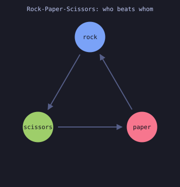
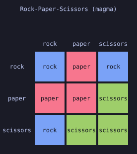
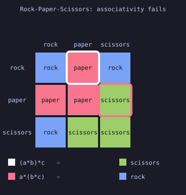
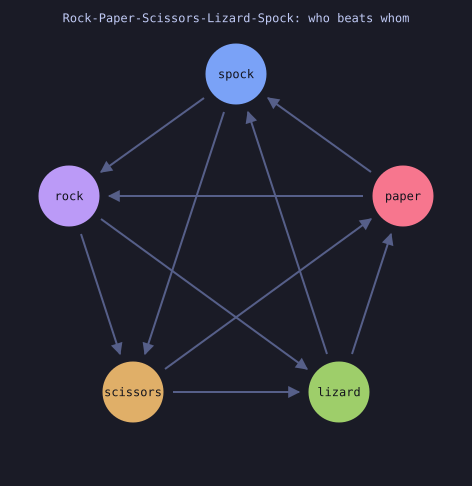

# sw-MLPL Abstract Algebra, Visually

Executable, **visual** demonstrations of abstract algebra — magmas,
semigroups, monoids, groups, and the structure-preserving maps between them —
written as standalone `.mlpl` scripts for the
[sw-MLPL](https://sw-ml-study.github.io/sw-mlpl/) interpreter.

The premise is small and does a lot of work:

> A finite binary operation on `n` elements **is** an `n x n` array.

So building one is a single `table(f, elements, elements)`; every law is an
array predicate with no explicit loop; every counterexample is an index into
that array; and the array is directly renderable — which is why this is a
*visual* demo repository rather than a test suite.

## Rock-Paper-Scissors is a magma, and no more



The game you already know: an arrow `a -> b` means *a beats b*. One closed loop,
no start and no end — which is why the game is fair, and the first hint that the
operation cannot be associative.



The same thing as algebra. `fight(a, b)` returns the winner — a closed binary
operation on three elements, so it is a magma, and this table is the whole of
it. Each square is colored by who won, so the structure is visible before a
single name is read. The arrows above are just the off-diagonal squares where
the row wins.

Nothing here *declares* what a structure is. Each lesson hands `elements` and
`operation` to a classifier and reports what came back:

```
  closed       yes
  associative  no
  commutative  yes
  identity     no
  inverses     no
  => magma
```

And a failed law names a witness rather than returning `false`:

```
  associativity counterexample:
    a = rock  b = paper  c = scissors
    (a*b)*c:  a*b = paper  ->  scissors
    a*(b*c):  b*c = scissors  ->  rock
```

### Watch it fail



Two markers walk the two bracketings of the same three elements and land on
different colors. *That* is what non-associativity looks like. The animation is
SMIL — text inside the SVG — so it needs no encoder, no GIF, and no language
capability that the static diagram did not already need.

*(If your viewer strips SVG animation you will see the first frame, which is a
correct static table.)*

### The same operation, drawn as a graph



Rock-Paper-Scissors-Lizard-Spock, at five elements. `a -> b` when `a * b = a`,
read straight off the Cayley table — so the picture cannot disagree with the
algebra. Every node has out-degree 2 and in-degree 2, which is why the game is
fair, and the drawing is the familiar pentagram.

Function, table, and graph are three views of one object. Five elements instead
of three adds no law: still a commutative magma.

### The two pictures the rest of the plan is built around

- **The identity's cross.** When `e` is a two-sided identity, row `e` and
  column `e` reproduce the headings. Ring them and the definition explains
  itself. *(Lesson 06.)*
- **The Latin square.** A group's table has every element exactly once in every
  row and column. Color by result and a group is recognizable at a glance; a
  mere monoid is not. *(Lesson 08.)*

### See it yourself in the browser, in four lines

The playground renders any result that starts with `<svg` as a widget. Paste
`web/magma_rps.mlpl`:

```mlpl
def u:fight(x, y) { if eq(mod(x - y + 3, 3), 1) { x } else { y } }
t = table(:u:fight, range(3), range(3))
t
svg(t, "heatmap")
```

Or `web/latin_square.mlpl`, which animates the difference between a magma and
a group using sw-MLPL's own `"life"` renderer — no hand-written SVG at all:

```mlpl
# Frame k marks every cell where a * b = k.
def u:frames(t, n) { reshape(transpose(one_hot(flatten(t), n)), [n, n, n]) }
svg(u:frames(table(:u:fight, range(3), range(3)), 3), "life")   # a magma: cells clump
svg(u:frames(table(:u:add3, range(3), range(3)), 3), "life")   # a group: every frame
                                                               # is a permutation matrix
```

**[docs/viewing.md](docs/viewing.md) covers every way to see these** — terminal
ASCII, `out/*.svg`, `--svg-out`, and the playground.

## Scope

This repository is **abstract algebra only**. Category theory — functors,
natural transformations, monads, adjunctions — is deferred to
`../demo-category-theory`, worked separately. The boundary, including the two
shared surfaces, is a written contract:
[docs/scope-boundary.md](docs/scope-boundary.md).

Words that collide across branches of mathematics ("groupoid", "kernel",
"product", "order") are disambiguated in each lesson header and registered in
[docs/terminology.md](docs/terminology.md). That is a feature of the pedagogy,
not boilerplate.

## Documents

- [docs/viewing.md](docs/viewing.md) — every way to see a visualization
- [docs/plan.md](docs/plan.md) — the twelve-lesson sequence and delivery order
- [docs/scope-boundary.md](docs/scope-boundary.md) — the contract with
  demo-category-theory
- [docs/sw-mlpl-work-order.md](docs/sw-mlpl-work-order.md) — **the handoff for
  the sw-MLPL agent**: every finding, with fix sites, proposed signatures,
  acceptance tests and a recommended order
- [docs/mlpl-blockers.md](docs/mlpl-blockers.md) — the sw-MLPL capabilities
  that block this work, specified for implementation
- [docs/upstream-asks.md](docs/upstream-asks.md) — the full friction record
- [docs/terminology.md](docs/terminology.md) — the word-collision register
- [docs/research.txt](docs/research.txt) — the source brief
- [AGENTS.md](AGENTS.md) — agent instructions and the AgentRail protocol
