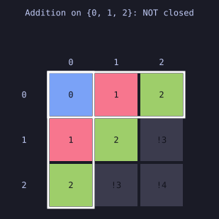
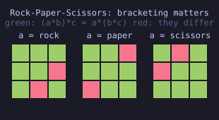
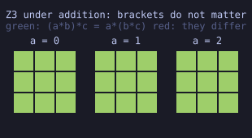
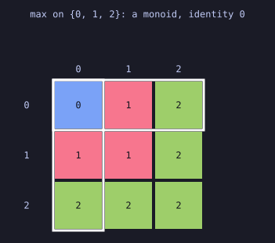
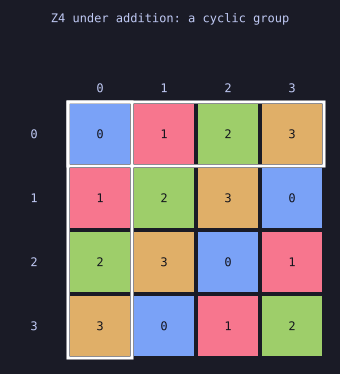
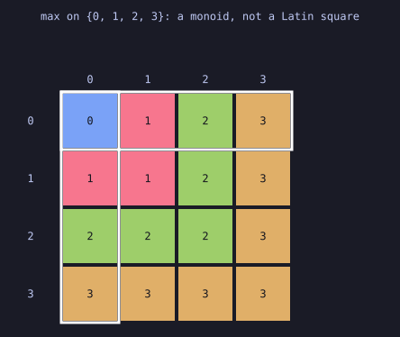
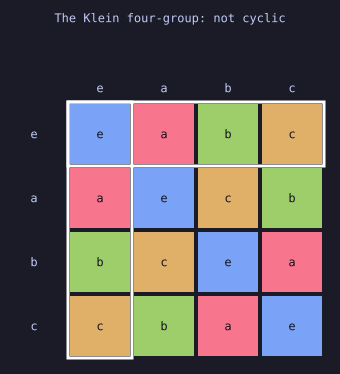

# sw-MLPL Abstract Algebra, Visually

Executable, **visual** demonstrations of abstract algebra — magmas,
semigroups, monoids, groups, and the structure-preserving maps between them —
written as standalone `.mlpl` scripts for the
[sw-MLPL](https://sw-ml-study.github.io/sw-mlpl/) interpreter.

The premise is small and does a lot of work:

> A finite binary operation on `n` elements **is** an `n x n` array.

So building one is a single `table(f, elements, elements)`; every law is an
array predicate with no explicit loop; every counterexample is an index into
that array; and the array is directly renderable — which is why this is a
*visual* demo repository rather than a test suite.

## Rock-Paper-Scissors is a magma, and no more


The game you already know: an arrow `a -> b` means *a beats b*. One closed loop,
no start and no end — which is why the game is fair, and the first hint that the
operation cannot be associative.


The same thing as algebra. `fight(a, b)` returns the winner — a closed binary
operation on three elements, so it is a magma, and this table is the whole of
it. Each square is colored by who won, so the structure is visible before a
single name is read. The arrows above are just the off-diagonal squares where
the row wins.

Nothing here *declares* what a structure is. Each lesson hands `elements` and
`operation` to a classifier and reports what came back:

```
  closed       yes
  associative  no
  commutative  yes
  identity     no
  inverses     no
  => magma
```

And a failed law names a witness rather than returning `false`:

```
  associativity counterexample:
    a = rock  b = paper  c = scissors
    (a*b)*c:  a*b = paper  ->  scissors
    a*(b*c):  b*c = scissors  ->  rock
```

### Watch it fail


Two markers walk the two bracketings of the same three elements and land on
different colors. *That* is what non-associativity looks like. The animation is
SMIL — text inside the SVG — so it needs no encoder, no GIF, and no language
capability that the static diagram did not already need.

*(If your viewer strips SVG animation you will see the first frame, which is a
correct static table.)*

### One element at a time



The 5×5 table for Rock-Paper-Scissors-Lizard-Spock, animated at about 1.6
seconds a frame. The labelled table never leaves the screen; each frame **rings
the pairings won by one element** and names it underneath.

Every frame rings the same shape: a hook hinged on the diagonal — the tie at
`(x, x)`, the two wins along `x`'s row, and those same two mirrored down `x`'s
column, because the operation is commutative. As the frames advance the hook
slides one step down the diagonal and wraps. That sliding *is* the five-fold
symmetry: every choice has the same shape of wins, just rotated. It is why the
game is fair, seen from the table side.

*(sw-MLPL's built-in `svg(frames, "life")` animates a frames array, but it is
unlabelled, single-coloured and fixed at 0.35s per frame — unreadable for a
Cayley table. `docs/upstream-asks.md` #12 and #13.)*

### The same operation, drawn as a graph


Rock-Paper-Scissors-Lizard-Spock, at five elements. `a -> b` when `a * b = a`,
read straight off the Cayley table — so the picture cannot disagree with the
algebra. Every node has out-degree 2 and in-degree 2, which is why the game is
fair, and the drawing is the familiar pentagram.

Function, table, and graph are three views of one object. Five elements instead
of three adds no law: still a commutative magma.

### Closure: the one law a magma needs



Ordinary addition on `{0, 1, 2}`. Coloured cells landed back inside the set;
grey cells marked `!3` and `!4` **escaped** it. The grey region is a triangle in
the corner, because addition grows with both inputs and "too large" is a
diagonal boundary.

Nothing is wrong with addition — it is simply not an operation *on this set*.
You repair an escape by shrinking the operation until it stays home (addition
modulo 3, which turns out to be a group) or by growing the set until it can
hold every result — and for addition that second road runs forever, which is
why the naturals are infinite.

### Associativity: 27 triples, sliced




Associativity asks about `n³` **triples** — one dimension more than a page has.
Slicing on the first element turns it into `n` square panels: panel `a` holds
that element fixed, rows are `b`, columns are `c`, so one small square is one
triple. Green means the two bracketings agreed.

Rock-Paper-Scissors (left) scatters red through all three panels — 6 of 27
triples disagree, so no single element is to blame. `Z₃` (right) is 27 green
squares, which is why nobody writes brackets around `1 + 2 + 3`.

Same code, same shape, same 27 triples in both. Only the colours differ.

### The identity's cross



`max` on `{0, 1, 2}`. One row and one column are ringed, crossing at the
top-left. Read along the ringed row — `0, 1, 2` — and it reproduces the column
headings exactly; read down the ringed column and it reproduces the row
headings. That is the whole definition of an identity, drawn: `e * x = x` going
across, `x * e = x` going down.

Nothing declares it. The cross appears wherever a search finds a row and a
column that both echo the headings, and it never appears twice — because
`e = e * f = f` means there is never a second identity.

### The Latin square




`Z₄` on the left is a **group**, and its table is a Latin square: look down any
row or across any column and you see four cells, four different colours, every
element present and none repeated. The colours march diagonally, because
adding 1 generates the whole group — that banding is what *cyclic* looks like.

`max` on the right is a **monoid** and not a group. Its bottom row is one
colour four times, with another colour missing entirely. A repeat means two
inputs give the same answer; a gap means some answer is unreachable. Same
failure from both sides, and both say: some element has no inverse.

The definition of a group never mentions rows or columns. The shape falls out
of having inverses, which is why you can classify a table across the room.

But the shape does not tell you *which* group:



The Klein four-group is also order 4, also abelian, also a Latin square — and
it is not `Z₄`. No diagonal march; the colours are symmetric about *both*
diagonals and the main diagonal is entirely the identity's colour, because
every element undoes itself. No relabelling can change how many elements
satisfy `a * a = e`, so no relabelling can turn one into the other. Lesson 11
makes that argument a search over all permutations.

### See it yourself in the browser, in four lines

The playground renders any result that starts with `<svg` as a widget. Paste
`web/magma_rps.mlpl`:

```mlpl
def u:fight(x, y) { if eq(mod(x - y + 3, 3), 1) { x } else { y } }
t = table(:u:fight, range(3), range(3))
t
svg(t, "heatmap")
```

Or `web/latin_square.mlpl`, which animates the difference between a magma and
a group using sw-MLPL's own `"life"` renderer — no hand-written SVG at all:

```mlpl
# Frame k marks every cell where a * b = k.
def u:frames(t, n) { reshape(transpose(one_hot(flatten(t), n)), [n, n, n]) }
svg(u:frames(table(:u:fight, range(3), range(3)), 3), "life")   # a magma: cells clump
svg(u:frames(table(:u:add3, range(3), range(3)), 3), "life")   # a group: every frame
                                                               # is a permutation matrix
```

**[docs/viewing.md](docs/viewing.md) covers every way to see these** — terminal
ASCII, `out/*.svg`, `--svg-out`, and the playground.

## Status

Verified baseline: `mlpl-repl 0.20.0` from the adjacent
`../sw-mlpl/target/release` build, with mlplunit for conformance.

Lessons 01–08 are implemented and green — the full ladder from magmas to
groups — with **0 explicit loops**, ASCII + static SVG + animated SVG output,
and three paste-ready Web UI demos. 12 demos and 14 tests pass. Lessons 09–12
are planned and queued; see [docs/plan.md](docs/plan.md).

## Quick start

```sh
just demos     # run every lesson; artifacts land in out/
just render    # rebuild out/ and list exactly what was written
just tests     # mlplunit conformance suite
just web       # regenerate the paste-ready Web UI demos in web/
just assets    # regenerate the diagrams this README embeds
just check     # the full local gate
```

The interpreter is found at `../sw-mlpl/target/release/mlpl-repl`, or wherever
`$MLPL` points. Nothing is installed and no stable binary is overwritten.

To see the diagrams in a browser instead, open
<https://sw-ml-study.github.io/sw-mlpl/>, click **Editor**, **Load** a file
from `web/`, press **Run**, then click **REPL** — see
[web/README.md](web/README.md).

## Layout

```
lib/algebra.mlpl      laws, classification, counterexamples, homomorphisms
lib/render.mlpl       ASCII / SVG / JSON renderers, static and animated
demos/NN-topic/*.mlpl one self-checking lesson per file
demos/web/*.mlpl      web demo sources
web/*.mlpl            GENERATED standalone copies — paste these into the Web UI
assets/*.svg          GENERATED diagrams this README embeds
probes/*.mlpl         capability probes against the interpreter
tests/test_*.mlpl     mlplunit conformance
out/                  scratch artifacts, gitignored
```

`web/` and `assets/` are generated and committed; `just check` fails if either
is stale, so they cannot drift from `lib/`.

## The second job: dogfooding sw-MLPL

When a law check, an enumeration, or a rendering turns out to be awkward or
impossible in ordinary `.mlpl`, the gap is recorded precisely rather than
worked around silently. The findings are written up as a work order for the
language team, with fix sites, proposed signatures and acceptance tests:
**[docs/sw-mlpl-work-order.md](docs/sw-mlpl-work-order.md)**.

**The loop closes.** Four findings have shipped upstream — `str_concat` /
`str_join`, `to_string`, string lists as `u:` arguments, and the bare-filename
CLI fix — and this repo adopted each the day it landed, **deleting the bridges
they justified**. Text generation is ordinary code now rather than a byte
round-trip; `str_join` taking a whole fragment list in one call turned the
worst code here into something readable; and the record wrapper that once
existed only to smuggle a string list past an argument check now stays only
where it earns its place.

`probes/text_capabilities.mlpl` runs under `just demos` and reports which
findings are still open, naming the bridge each closure makes deletable.

The wins are recorded too. `table(f, a, b)` gives the Cayley table in one line,
and `gather_rows` + `transpose_axes` express the `n^3` associativity check with
no loop and no comprehension syntax — which is precisely the question the
source brief posed.

## Scope

This repository is **abstract algebra only**. Category theory — functors,
natural transformations, monads, adjunctions — is deferred to
`../demo-category-theory`, worked separately. The boundary, including the two
shared surfaces, is a written contract:
[docs/scope-boundary.md](docs/scope-boundary.md).

Words that collide across branches of mathematics ("groupoid", "kernel",
"product", "order") are disambiguated in each lesson header and registered in
[docs/terminology.md](docs/terminology.md). That is a feature of the pedagogy,
not boilerplate.

## Documents

- [docs/viewing.md](docs/viewing.md) — every way to see a visualization
- [docs/plan.md](docs/plan.md) — the twelve-lesson sequence and delivery order
- [docs/scope-boundary.md](docs/scope-boundary.md) — the contract with
  demo-category-theory
- [docs/sw-mlpl-work-order.md](docs/sw-mlpl-work-order.md) — **the handoff for
  the sw-MLPL agent**: every finding, with fix sites, proposed signatures,
  acceptance tests and a recommended order
- [docs/mlpl-blockers.md](docs/mlpl-blockers.md) — the sw-MLPL capabilities
  that block this work, specified for implementation
- [docs/upstream-asks.md](docs/upstream-asks.md) — the full friction record
- [docs/terminology.md](docs/terminology.md) — the word-collision register
- [docs/research.txt](docs/research.txt) — the source brief
- [AGENTS.md](AGENTS.md) — agent instructions and the AgentRail protocol
